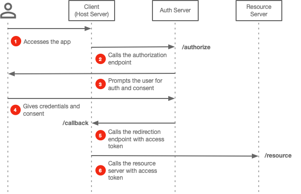

# OAuth2

## Terminology

### Roles

In OAuth2, there are 4 roles involved in an authorization flow:

* **Resource Owner** – The user or entity that owns the resources (data) on the resource server.
* **Resource Server** – The service hosting the resources.
* **Client** – Also known as application requesting to access the resources on the resource server on the behalf of the owner. Application or client can be used interchangeably.
* **Authorization Server** – A service that authorizes the client to access the resources by authenticating the resource owner (and client depending on the flow used) and ask for the consent of resource owner to grant access to the client. An authorization server doesn't need to operated by the same entity, it just need to be trusted by the resource server.

### Client Types

OAuth2 defines 2 client types:

* **Confidential Client** - A client that is capable of storing confidential secrets to authenticate itself to an authorization server.
* **Public Client** - A client that can't securely store secrets.

### Client Profiles

OAuth2 defines 3 profiles:

* **Web Application** - Basically a confidential client that is the host server of a web application capable of authenticating itself to the authorization server.
* **User Agent Application** - The code could be downloaded and executed on a user agent eg. web browser. A public client is assumed for this profile.
* **Native Application** - Another variant of public client with code built and executed directly natively on the user's device, eg. desktop or mobile apps.

### Types of Tokens

* **Authorization Code** - Also known as auth code, it's a one-time intermediary token used in 2-legged OAuth2 flow.
* **Access Token** - The token that is used to access the resource server.
* **Refresh Token** - The token that is used to request a new access token.
* **ID Token** - This isn't part of OAuth2 specs, but it is a JSON web token (JWT) that is return after a successful authorization grant by the resource owner that provides details about the user identity.

### Endpoints

OAuth2 defines the following endpoints:

* Authorization
* Token
* Redirection

The endpoints are referenced in the flow diagrams below.

## Authorization Grant

OAuth2 defines 4 ways that a client can be granted authorization to access a resource server:

* Authorization Code Grant
* Implicit Grant
* Resource Owner Password Credentials Grant
* Client Credentials Grant

### Authorization Code Grant


1. The resource owner (user) accesses the application (the client).
1. The hosting server of the application calls the authorization endpoint on the authorization (auth) server with the following parameters:

   | Params          | Req'd | Description |
   |-----------------|:-----:|-------------|
   | `client_id`     |   ✓   | The id of the client that was assigned when the application was registered on the auth server. |
   | `response_type` |   ✓   | Grant type for this flow. Set to `code`. |
   | `redirect_uri`  |       | The redirect uri representing the redirection endpoint on the client to where the `authorization_code` and `state` will be sent. |
   | `scope`         |       | The scope of access permissions that the client is requesting. |
   | `state`         |       | This is a unique token that is generated by the client to mitigate the risk of CSRF attacks. The value will be included in the redirection request and verified that the state isn't tampered. |

   ```http request
   GET /authorize?client_id=<client_id>&response_type=code&redirect_uri=<redirect_uri>&scope=<scopes_delimited_by_space>&state=<state>
   ```

1. The auth server prompts the user to authenticate him/herself and grant consent for the application to access the user's resources on the resource server.
1. The user provides his/her credentials to log in and consent.
1. Assuming a happy path where the user successfully logs in and authorizes the application, the auth server will redirect (status code 302) to the redirection endpoint on the client (as specified in the `redirect_uri`) with the following parameters in the response:

   | Params          | Req'd | Description |
   |-----------------|:-----:|-------------|
   | `code`          |   ✓   | The authorization code, which will be used to request for an access token. |
   | `state`         |   ✓   | The token that was provided by the client earlier. |

   ```
   HTTP/1.1 302 Found
   Location: <redirect_uri>?code=<auth_code>&state=<state>
   ```

1. The client validates the `state` to ensure that the value matches what the state value that it generated earlier. This ensures that the request/response for the auth code have not been tampered. The client then calls the token endpoint with the following parameters:

   | Params          | Req'd | Description |
   |-----------------|:-----:|-------------|
   | `client_id`     |   ✓   | The id of the client that was registered on the auth server. |
   | `client_secret` |   ✓   | The client secret that was obtained from the auth server during registration. |
   | `code`          |   ✓   | The auth code that was received by the client. |
   | `grant_type`    |   ✓   | Set it to `authorization_code`. |
   | `redirect_uri`  |   ✓   | If this call is successful, the auth will redirect the response to this uri. The value should match the `redirect_uri` that was passed in the authorization request that was made earlier. |

   ```
   POST /token HTTP/1.1
   Host: auth-server.com
   Content-Type: application/x-www-form-urlencoded

   client_id=<client id>&client_secret=<client_secret>&code=<auth_code>&grant_type=authorization_code&redirect_uri&<redirect_uri>
   ```

1. The auth server returns the following response:

   | Params          | Req'd | Description |
   |-----------------|:-----:|-------------|
   | `access_token`  |   ✓   | The access token that will be used in making calls to the resource server. |
   | `token_type`    |   ✓   | The type of token. This is set to `Bearer`. |
   | `expires_in`    |   ✓   | The number of seconds the access token expires and becomes invalid. |
   | `refresh_token` |       | The token (if provided) that will be used to get a new access token. |

   ```
   HTTP/1.1 200 OK
   Content-Type: application/json
   Cache-Control: no-store
   Pragma: no-cache
   {
     "access_token": <access_token>,
     "token_type": "Bearer",
     "expires_in": <access_token_expiration>,
     "refresh_token": <refresh_token>
   }
   ```

1. The client calls the resource server using the access token.

Here's the [original specs for Authorization Code Grant](https://tools.ietf.org/html/rfc6749#section-4.1).

#### Authorization Code Grant + PKCE

The original authorization code grant can be made more secured using an additional verification mechanism called Proof Key for Code Exchange (PKCE), which basically ensures the client making the client requesting the auth code is the same client requesting the access token using that same auth code.

### Implicit Grant



Here's the [original specs for Implicit Grant](https://tools.ietf.org/html/rfc6749#section-4.2).

### Resource Owner Password Credentials Grant


Here's the [original specs for Resource Owner Password Credentials Grant](https://tools.ietf.org/html/rfc6749#section-4.3).

### Client Credentials Grant


Here's the [original specs for Client Credentials Grant](https://tools.ietf.org/html/rfc6749#section-4.4).

### Error Response

There are 2 types of error that can occur during an OAuth2 flow.

* The resource owner to be informed of errors in the `redirect_uri` or `client_id` eg. invalid or missing parameter.
* The client be informed of errors other than those related to `redirect_uri` and `client_id` (the above). For example, resource owner denies access, invalid scope, malformed request, etc.

The error response includes the following parameters:

| Params              | Req'd | Description |
|---------------------|:-----:|-------------|
| `error`             |   ✓   | Error code. See a list of predefined codes [here](https://tools.ietf.org/html/rfc6749#section-4.1.2.1). |
| `error_description` |       | Text providing additonal information about the error. |
| `error_uri`         |       | A URI pointing to a human-readable web page with information about the error. |
| `state`             |   ✓   | The state param is included in the error response if the `state` parameter was found in the request. |

# Reference

* [Solving Identity Management in Modern Applications: Demystifying OAuth 2.0, OpenID Connect, and SAML 2.0](https://www.apress.com/us/book/9781484250945) by Yvonne Wilson and Abhishek Hingnikar, Apress Publishing, 2019
* [RFC 6749 - The OAuth 2.0 Authorization Framework](https://tools.ietf.org/html/rfc6749)
